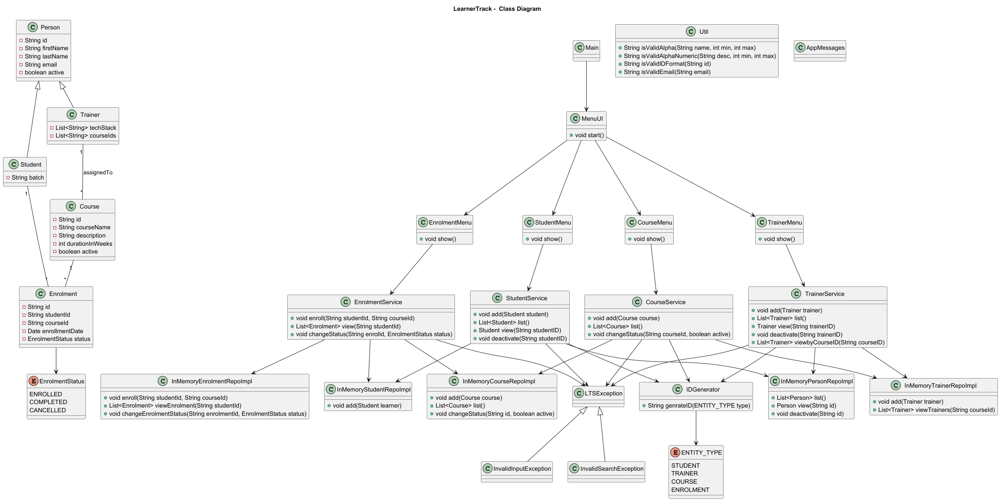
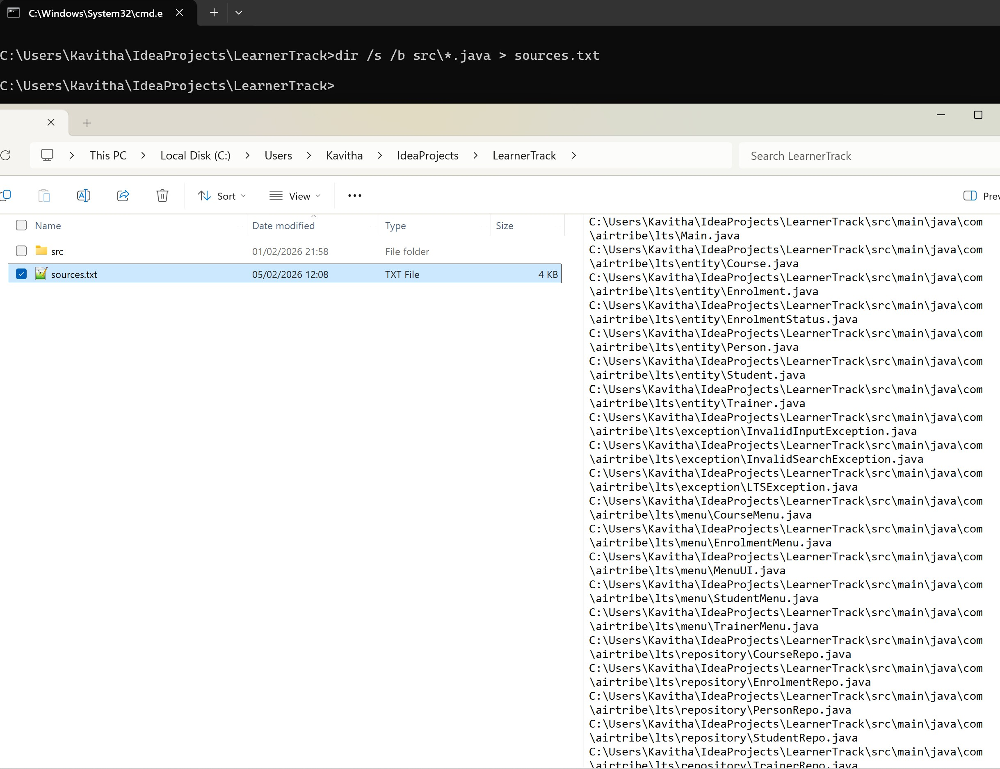
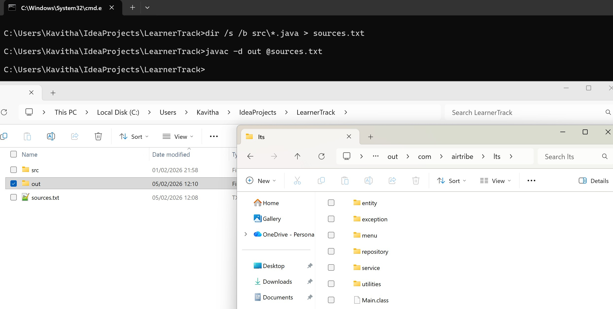
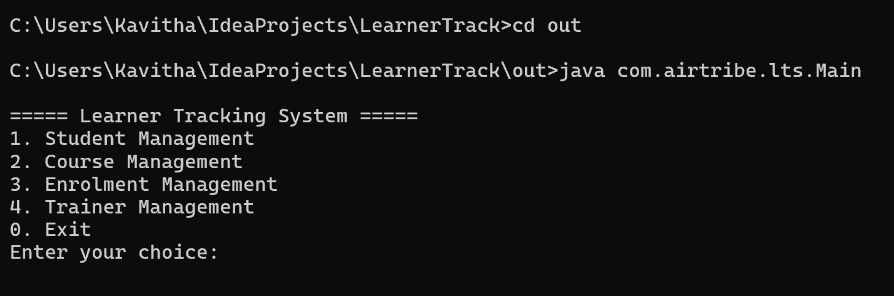

# Learner Track System

## Project Description

LearnerTrack is a Java-based console application designed to manage learners in a training environment.  
The system supports the management of **Students**, **Trainers**, **Courses**, and **Enrolments**, and demonstrates core object-oriented programming concepts.
The system uses Memory 
The project was developed as part of a course assignment to apply Java fundamentals and software design principles, including:
- Object-oriented design (polymorphism, abstraction, inheritance and encapsulation)
- Use of collections
- Singleton pattern for service classes
- Separation of concerns using entities, repositories, services, utilities, and exceptions

This project uses an in-memory data store instead of a persistent database.
Data is stored temporarily using Java collections such as ArrayList while the application is running.

The in-memory approach was chosen because the focus of the project is on object-oriented design and application logic, rather than database integration.
It simplifies the implementation and removes external dependencies such as database servers or configuration files.

When the application terminates, the data is cleared from memory.

## Class Diagram



---

## How to Compile and Run

### Prerequisites
- Java Development Kit (JDK) 17 or later
- command prompt

---

### Compile the Project

1. Open a terminal in the project root directory.

- Create sources.txt file with all java files by running the command
````
C:\Users\Kavitha\IdeaProjects\LearnerTrack>dir /s /b src\*.java > sources.txt
````


2. Compile all Java files using the following command:
- The command will create ``out`` folder with all the class files.
````
C:\Users\Kavitha\IdeaProjects\LearnerTrack>javac -d out @sources.txt
````



### Run the Project
1. Navigate to out directory.
2. Run the Main class as shown below.
````
C:\Users\Kavitha\IdeaProjects\LearnerTrack>cd out
C:\Users\Kavitha\IdeaProjects\LearnerTrack\out>java com.airtribe.lts.Main
````

